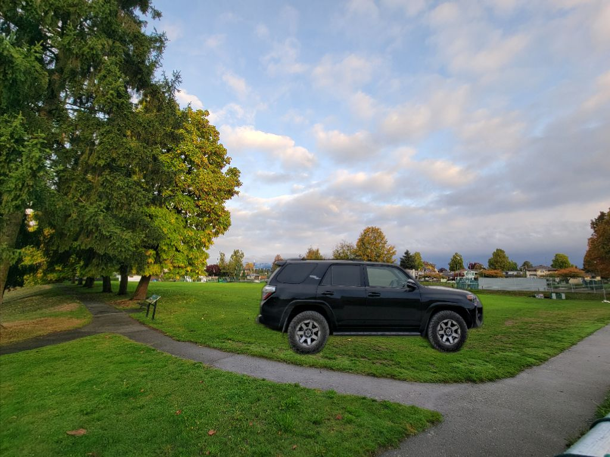
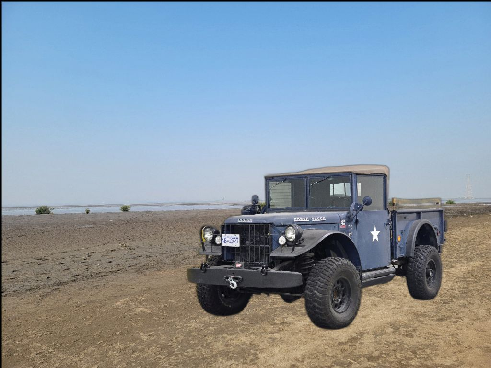
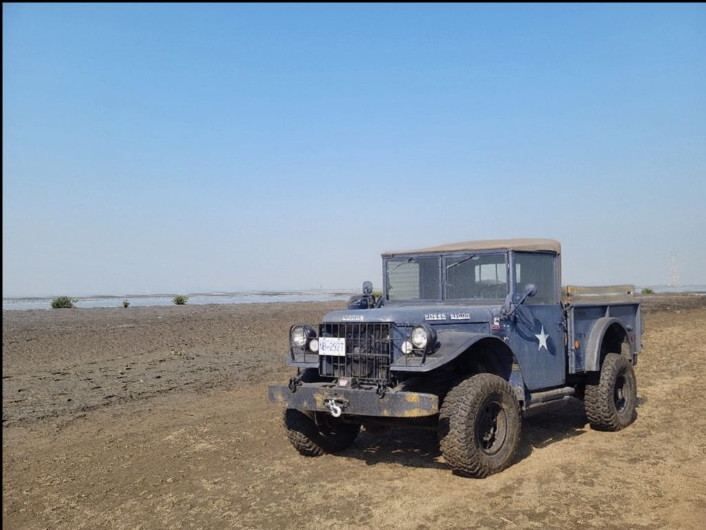
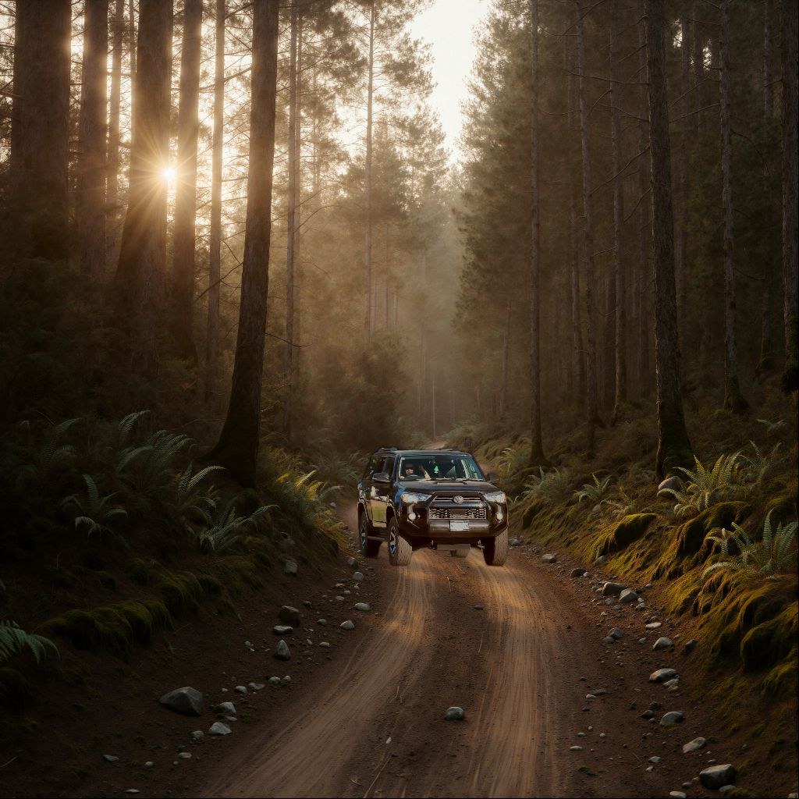
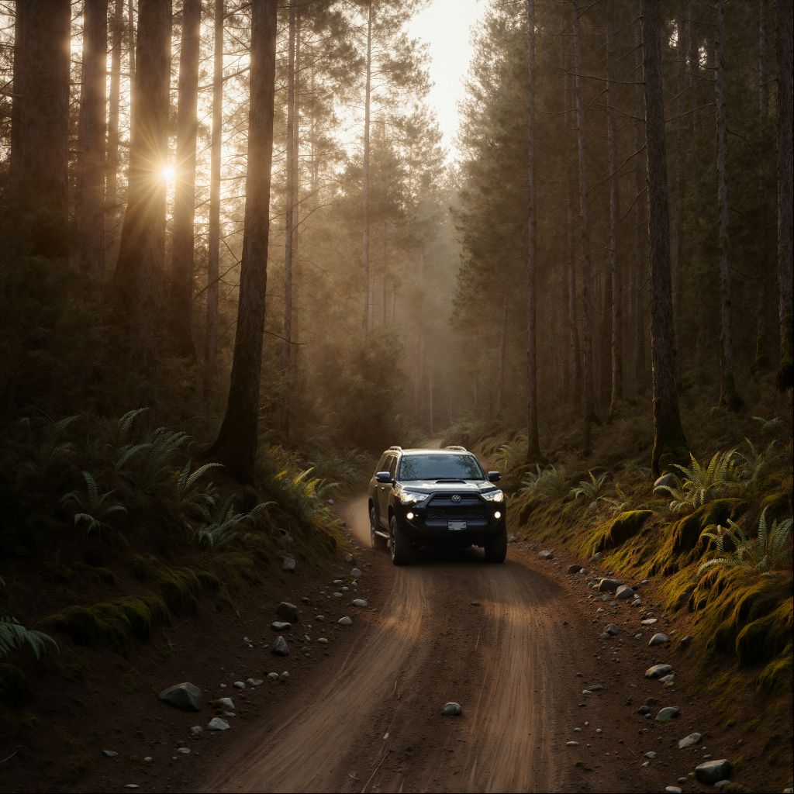
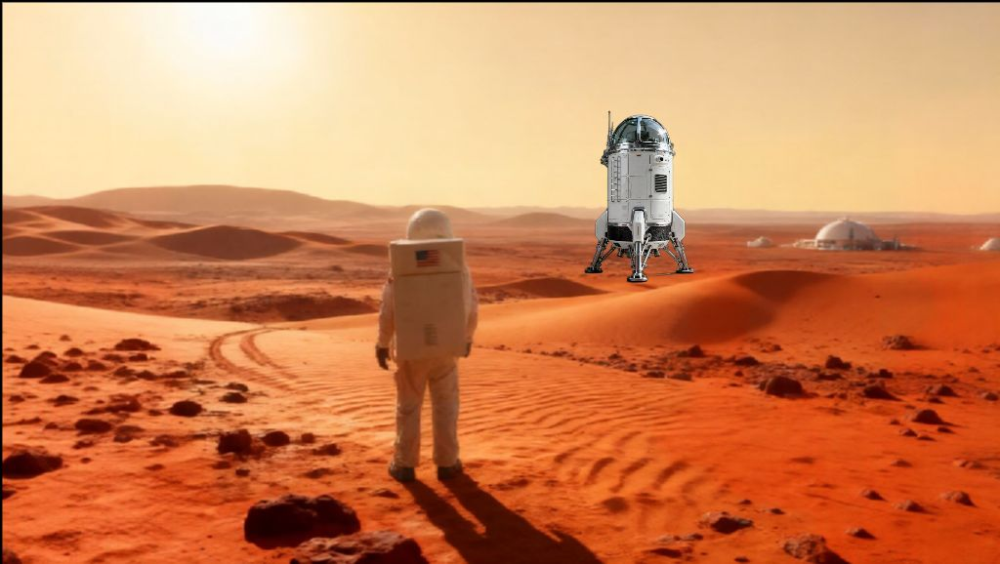
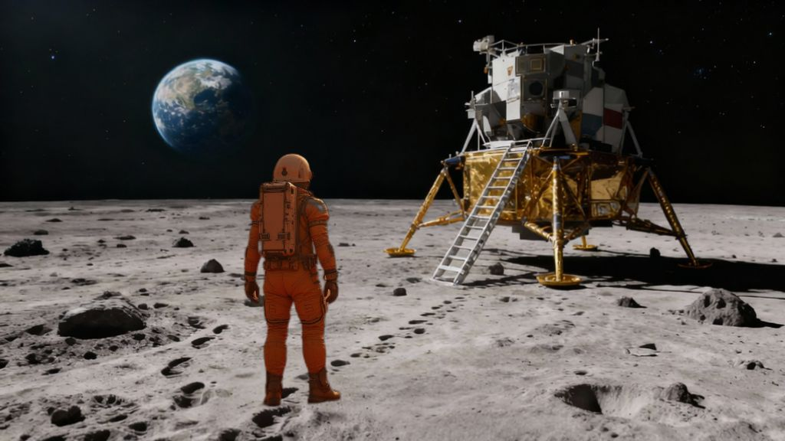
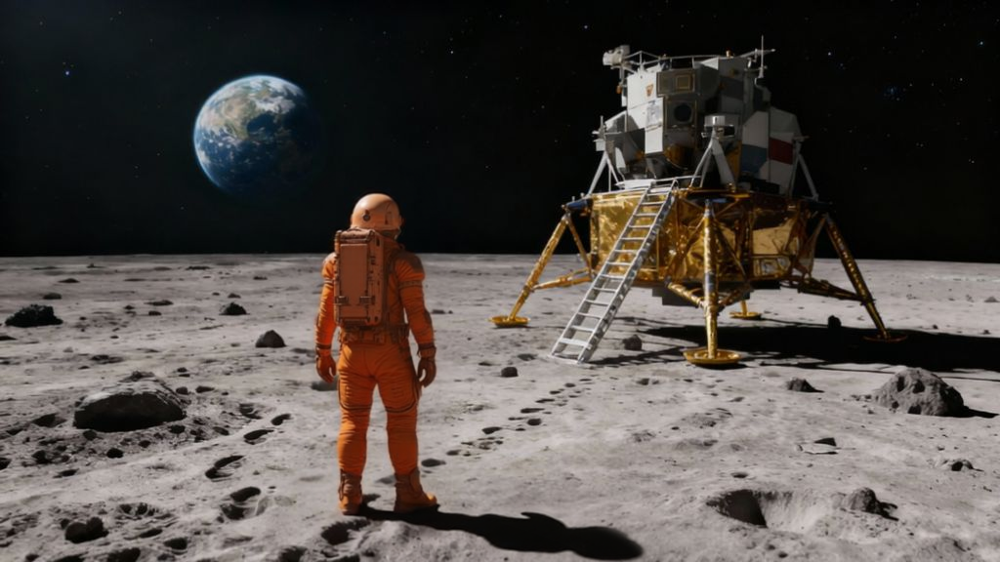

# QWEN-AI-Compositing
AI compositing workflow built on Qwen Image Edit 2509 with Fusion LoRA. Import BG and subject, remove background, composite and mask areas (including shadows), then prompt the model to auto-match lighting, color, and shadows for a seamless, realistic result. Credits to the Qwen model and LoRA creators.

# 🧠 AI Compositing Workflow – Subject Integration in ComfyUI

This repository contains a **ComfyUI workflow** for realistic subject integration using **Qwen Image Edit 2509** with **Fusion LoRA**.  
It’s designed to automate the process of compositing a subject over a background — intelligently matching lighting, color grading, and shadows for a seamless final result.

---

## 🎬 Overview

Traditional compositing requires manual relighting, color correction, and shadow work to unify the subject and background.  
This workflow leverages **diffusion-based AI harmonization** to handle those tasks automatically while keeping full artistic control over layout and intent.

The process involves:
1. Importing and resizing the **background** and **subject**.
2. **Removing** the subject’s background using AI segmentation.
3. **Positioning and scaling** the subject over the background.
4. **Masking** areas for compositing and shadow interaction.
5. Adding a **natural language prompt** describing the final look.
6. Letting **Qwen Image Edit + Fusion LoRA** infer lighting, grading, and shadow adjustments.
7. Comparing and saving the **final photorealistic composite**.

---

## ⚙️ Requirements

- [ComfyUI](https://github.com/comfyanonymous/ComfyUI)
- Models:
  - `qwen_image_edit_2509_fp8_efdm3m.safetensors`
  - `Qwen-Fusion-LoRA`
  - `Qwen-Image-Lightning LoRAs (V1.0 / V1.1)`
  - `qwen_2_5_v1_7b_fp8_scaled.safetensors` (CLIP)
  - `qwen_image_vae.safetensors` (VAE)

Place models in:
    ComfyUI/models/checkpoints/
    ComfyUI/models/loras/
    ComfyUI/models/vae/
    ComfyUI/models/clip/

---

## 🧩 Workflow Breakdown

| Step | Description |
|------|--------------|
| **1.** | Import and resize background image |
| **2.** | Import subject and remove its background |
| **3.** | Composite subject over background |
| **4.** | Mask subject and shadow regions |
| **5.** | Apply prompt and run diffusion harmonization |
| **6.** | Compare AI composite with base comp |
| **7.** | Save final image to disk |

---

## 💡 Example Prompt

A cinematic photo of a spacecraft on a Martian desert beside an astronaut, realistic lighting, soft shadows, 50mm lens.

No need to specify color correction or light direction — the model automatically adapts these elements.

---

## 🧠 How It Works

The workflow combines:
- **Qwen Image Edit 2509** for diffusion-based inpainting and relighting.  
- **Fusion LoRA** for blending subject and background colors naturally.  
- **Lightning LoRAs** for fast, detailed refinement.  
- **CLIP + VAE** for high-fidelity text/image understanding and decoding.

Together, they turn ComfyUI into a **context-aware compositing environment** — fusing manual control with AI intuition.

---

## 📸 Output Example

| Rough Composite | AI Composite |
|------------------|--------------|
|  |  |
|  |  |
|  |  |
|  |  |
|  |  |

---

## 🙏 Credits

- **Qwen Image Edit 2509** by the original authors  
- **Fusion LoRA** and **Lightning LoRAs** by their respective creators  
- Workflow design and optimization by [Your Name]

All rights and model ownership belong to their respective authors.

---

## 🧾 License

This project is released under the **MIT License**.  
You are free to modify and adapt it with proper credit to the model and LoRA creators.

---

## 🌐 Connect

If you use or modify this workflow, feel free to share results or improvements — pull requests and suggestions are welcome!

---

> _"Human intent meets AI precision — compositing made effortless."_
